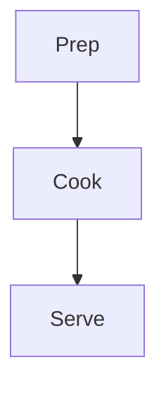

# RecipeAtlas Recipe Authoring Guide

This guide explains how to add a new recipe article to RecipeAtlas. It is written for future recipes, so you can copy the examples and change only the recipe details.

## Folder Structure

Recipes live inside language folders:

```text
src/content/recipes/ta/
src/content/recipes/en/
```

For every recipe, create one Markdown file per language:

```text
src/content/recipes/ta/egg-masala-noodles.md
src/content/recipes/en/egg-masala-noodles.md
```

Use the same `translationKey` and `slug` in every language version. This lets the language switcher connect Tamil and English pages.

## Basic File Template

Copy this template for a new recipe:

```md
---
title: Recipe Title
translationKey: recipe-slug
slug: recipe-slug
summary: One short sentence about the recipe.
category: veg
tags:
  - breakfast
  - homemade
featured: false
published: 2026-07-12
updated: 2026-07-12
difficulty: Easy
servings: 4
prepTime: 15 min
cookTime: 20 min
totalTime: 35 min
cover: DEFAULT_IMG
ingredients:
  - group: Main
    name: Ingredient name
    quantity: 1
    unit: cup
  - group: Main
    name: Salt
    note: As required
nutrition:
  calories: 250
  protein: 8 g
mediaEmbeds:
  - type: youtube
    id: VIDEO_ID_HERE
    title: Recipe video
    startTime: 30
---

Write the recipe introduction here.

## Method

1. First step.
2. Second step.
3. Third step.

## Tips

Add useful cooking notes here.
```

## Required Frontmatter

These fields are important:

- `title`: Page title.
- `translationKey`: Same value for all language versions of the same recipe.
- `slug`: URL path. Example: `egg-masala-noodles` becomes `/recipes/egg-masala-noodles/`.
- `summary`: Short description used in cards, search, and social previews.
- `category`: Use only `veg` or `non-veg`.
- `tags`: Search and tag page labels.
- `published` and `updated`: Dates in `YYYY-MM-DD` format.
- `cover`: Image key from `src/data/images/registry.js`.
- `ingredients`: Structured ingredient list shown in the sidebar.

## Ingredients Format

Use `group` to divide ingredients into sections:

```yaml
ingredients:
  - group: Masala
    name: Turmeric powder
    quantity: 0.5
    unit: tsp
  - group: Masala
    name: Salt
    note: As required
```

Use `note` when there is no exact quantity.

## Images

Current image keys are in:

```text
src/data/images/registry.js
```

Example usage:

```yaml
cover: EGG_NOODLES
```

Inside the recipe body, use:

```njk

```

When you add a new image later, add it to:

```text
src/data/images/
src/data/images/registry.js
```

If a real cover photo is not ready, use:

```yaml
cover: DEFAULT_IMG
```

or temporarily use an existing image key like:

```yaml
cover: BIRYANI
```

## Video And Social Embeds

RecipeAtlas supports media cards through `mediaEmbeds`.

### YouTube

```yaml
mediaEmbeds:
  - type: youtube
    id: K6o9JTcPgOA
    title: Idli batter guide
    startTime: 85
```

Use only the video ID, not the full URL.

For this URL:

```text
https://www.youtube.com/watch?v=K6o9JTcPgOA
```

The ID is:

```text
K6o9JTcPgOA
```

### YouTube Shorts

```yaml
mediaEmbeds:
  - type: youtube-short
    id: WcLbw92V4qk
    title: Biryani layering
```

### Instagram

```yaml
mediaEmbeds:
  - type: instagram
    id: DXHprmqgQQK
    title: Visual guide
```

For this URL:

```text
https://www.instagram.com/p/DXHprmqgQQK/
```

The ID is:

```text
DXHprmqgQQK
```

If there is no video, remove the `mediaEmbeds` block.

## Mermaid Diagrams

You can add a diagram in the recipe body:

````md

````

## Translation Checklist

When adding Tamil and English versions:

- Keep the same `translationKey`.
- Keep the same `slug`.
- Translate `title`, `summary`, ingredient `group`, ingredient `name`, notes, headings, and recipe body.
- Keep image keys and embed IDs the same unless each language needs different media.
- Use the same `category` in both files.

## Current Example

Healthy Egg Noodles was added as:

```text
src/content/recipes/ta/egg-masala-noodles.md
src/content/recipes/en/egg-masala-noodles.md
```

Title used:

```text
Tamil: ஆரோக்கியமான முட்டை மசாலா நூடுல்ஸ்
English: Wholesome Egg Masala Noodles
```

Temporary cover:

```yaml
cover: BIRYANI
```

Change the cover later when the real noodles photo is ready.

## Build Check

After adding or editing recipes, run the Eleventy build and check that no errors appear. A successful build means the pages, search index, feed, and sitemap were generated.
