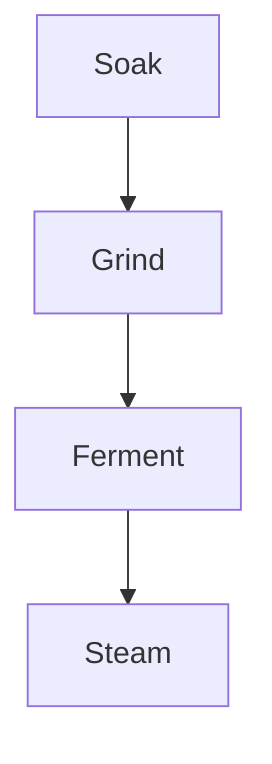

Soft idli depends on hydrated grains, a fluffy urad dal grind, and steady fermentation. Keep the batter thick enough to mound gently when spooned.



## Instructions

1. Rinse rice, urad dal, and fenugreek seeds until the water runs mostly clear.
2. Soak rice and dal separately for 5 to 6 hours.
3. Grind the dal until fluffy, then grind rice with a slightly coarse texture.
4. Mix both batters with salt and ferment overnight.
5. Steam in greased idli moulds for 10 to 12 minutes.

## Storage

Refrigerate fermented batter for up to three days. Let chilled batter sit at room temperature for 20 minutes before steaming.
