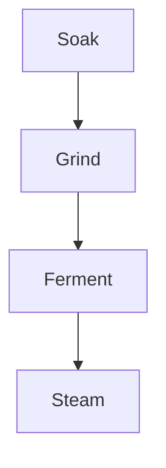

இட்லி மாவின் ரகசியம் அரிசி மற்றும் உளுந்தை தனித்தனியாக ஊறவைத்து, சரியான வெப்பத்தில் புளிக்க விடுவதில் இருக்கிறது.



## செய்முறை

1. அரிசி, உளுந்து, வெந்தயம் ஆகியவற்றை கழுவி தனித்தனியாக ஊறவைக்கவும்.
2. முதலில் உளுந்தை மென்மையான பஞ்சு பதமாக அரைக்கவும்.
3. அரிசியை சற்று மணல் பதம் இருக்கும் வரை அரைக்கவும்.
4. இரண்டையும் சேர்த்து உப்பு கலந்து இரவு முழுவதும் புளிக்க விடவும்.
5. இட்லி தட்டில் எண்ணெய் தடவி 10 முதல் 12 நிமிடம் ஆவியில் வேகவைக்கவும்.

## குறிப்புகள்

குளிரான காலநிலையில் மாவை அடுப்பின் விளக்கு மட்டும் எரியும் ஓவன் உள்ளே வைக்கலாம். மாவு இரட்டிப்பு அளவுக்கு உயர்ந்தவுடன் உடனே குளிர்சாதனப் பெட்டியில் வைக்கவும்.
